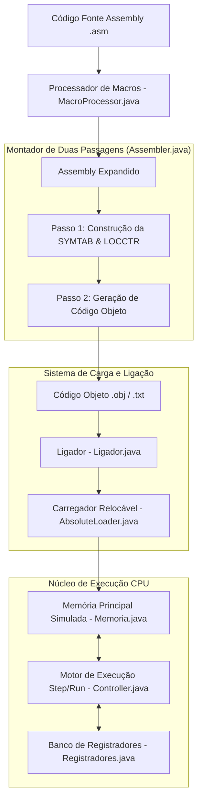

# Simulador e Ambiente de Software Básico SIC/XE

Simulador gráfico interativo, Montador de Duas Passagens, Processador de Macros, Ligador e Carregador para a arquitetura de computador hipotética **SIC/XE** (*Simplified Instructional Computer Extra Equipment*), baseada na obra clássica de Leland L. Beck (*System Software: An Introduction to Systems Programming*).

[](https://www.oracle.com/java/)
[](https://openjfx.io/)
[](https://en.wikipedia.org/wiki/Simplified_Instructional_Computer)
[](LICENSE)

Trabalho desenvolvido na disciplina de Software Básico / Sistemas Operacionais — Engenharia de Computação, Universidade Federal de Pelotas (UFPel).

---

## Sumário

- [Visão Geral](#visão-geral)
- [Arquitetura do Sistema e Pipeline de Execução](#arquitetura-do-sistema-e-pipeline-de-execução)
- [Mapeamento de Registradores](#mapeamento-de-registradores)
- [Formatos de Instrução e Modos de Endereçamento](#formatos-de-instrução-e-modos-de-endereçamento)
- [Interface Gráfica (JavaFX)](#interface-gráfica-javafx)
- [Estrutura do Repositório](#estrutura-do-repositório)
- [Compilação e Execução](#compilação-e-execução)
- [Autor](#autor)
- [Licença](#licença)

---

## Visão Geral

O **SIC/XE** é uma máquina de ensino amplamente adotada na literatura acadêmica para o aprendizado de arquitetura de computadores, montadores, carregadores e sistemas operacionais. Este projeto implementa a **suíte completa de software básico** do SIC/XE em linguagem Java com interface gráfica em JavaFX:

1. **Processador de Macros:** Realiza a expansão de definições de macros, substituição de parâmetros reais/formais e geração do código assembly intermediário expandido.
2. **Montador de Duas Passagens (*Two-Pass Assembler*):**
   - **Passo 1:** Constrói a Tabela de Símbolos (`SYMTAB`), calcula o Contador de Localização (`LOCCTR`) e valida mnemônicos (`OPTAB`).
   - **Passo 2:** Gera o Código Objeto completo (`Record Header`, `Record Text`, `Record Modification` e `Record End`) para instruções dos Formatos 1, 2, 3 e 4.
3. **Ligador Relocável (*Linker*):** Resolve referências externas entre diferentes seções de controle (`EXTDEF` e `EXTREF`) e aplica registros de modificação (`M`).
4. **Carregador Relocável (*Loader*):** Carrega o código objeto ligado na memória principal simulada no endereço base especificado.
5. **Máquina de Execução e Registradores:** Simula o ciclo de busca e execução de instruções (*Fetch-Decode-Execute*), atualizando a memória principal e o banco de registradores em tempo real.

---

## Arquitetura do Sistema e Pipeline de Execução



---

## Mapeamento de Registradores

A máquina SIC/XE simulada disponibiliza **9 registradores de hardware** acessíveis para operações de aritmética, indexação e controle de fluxo:

| Mnemônico | Número (Hex) | Tamanho | Função Principais |
|---|:---:|:---:|---|
| **A** | `0` | 24 bits | Acumulador (Operações aritméticas principais) |
| **X** | `1` | 24 bits | Registrador de Índice (Endereçamento indexado) |
| **L** | `2` | 24 bits | Registrador de Ligação (*Linkage* / Endereço de retorno de sub-rotinas) |
| **B** | `3` | 24 bits | Registrador Base (Endereçamento relativo à base) |
| **S** | `4` | 24 bits | Registrador de Uso Geral |
| **T** | `5` | 24 bits | Registrador de Uso Geral |
| **F** | `6` | 48 bits | Acumulador de Ponto Flutuante (IEEE 754) |
| **PC** | `8` | 24 bits | Contador de Programa (*Program Counter*) |
| **SW** | `9` | 24 bits | Palavra de Status (*Status Word* / Flags de condição `<, =, >`) |

---

## Formatos de Instrução e Modos de Endereçamento

O montador e o executor possuem suporte completo aos 4 formatos de instrução da arquitetura SIC/XE:

- **Format 1 (1 byte):** Apenas o código de operação (`op`).
- **Format 2 (2 bytes):** Código de operação + registradores (`op`, `r1`, `r2`).
- **Format 3 (3 bytes):** Instrução padrão com deslocamento de 12 bits (`op`, `n`, `i`, `x`, `b`, `p`, `e`, `disp`).
- **Format 4 (4 bytes / Estendido):** Endereçamento direto de 20 bits com a flag `e = 1` (`op`, `n`, `i`, `x`, `b`, `p`, `e`, `address`).

### Flags de Modos de Endereçamento (`n i x b p e`):
- `n=1, i=0`: Endereçamento Indireto (*Indirect*)
- `n=0, i=1`: Endereçamento Imediato (*Immediate*)
- `n=1, i=1`: Endereçamento Simples (*Simple*)
- `x=1`: Endereçamento Indexado (*Indexed*)
- `b=1, p=0`: Endereçamento Relativo à Base (*Base-relative*)
- `b=0, p=1`: Endereçamento Relativo ao Contador de Programa (*PC-relative*)
- `e=1`: Formato Estendido de 4 Bytes (*Extended Format*)

---

## Interface Gráfica (JavaFX)

A aplicação conta com um painel de controle interativo construído em **JavaFX**, permitindo inspecionar o estado interno da máquina durante a execução:

<p align="center">
  
</p>
<p align="center"><sub>Ambiente de depuração do simulador SIC/XE: inspeção de registradores, memória principal, código assembly e execução passo a passo (Step/Run).</sub></p>

---

## Estrutura do Repositório

```
sic-xe-simulator/
├── simulator/
│   └── src/
│       ├── App.java                 # Ponto de entrada da aplicação JavaFX
│       ├── Controller.java          # Controlador da interface e ciclo de instrução
│       ├── style.fxml               # Layout FXML da interface gráfica
│       ├── styless.css              # Estilização CSS da aplicação
│       ├── Carregador/
│       │   └── AbsoluteLoader.java  # Carregador de Código Objeto para a memória
│       ├── Ligador/
│       │   └── Ligador.java         # Ligador Relocável e resolução de símbolos
│       ├── Mem/
│       │   ├── Memoria.java         # Banco de Memória Principal (1 MB)
│       │   └── Palavramem.java      # Estrutura de palavra de memória
│       ├── Montador/
│       │   ├── Assembler.java       # Montador de Duas Passagens (Pass 1 & Pass 2)
│       │   └── Macros/
│       │       └── MacroProcessor.java # Processador e expansor de macros
│       ├── Regs/
│       │   ├── Registrador.java     # Abstração de Registrador de Hardware
│       │   └── Registradores.java   # Banco com os 9 Registradores do SIC/XE
│       └── utils/                   # Arquivos de teste, tabelas OPTAB e arquivos intermediários
├── codigoFonte.asm                  # Programa de exemplo em Assembly SIC/XE
├── image.png                        # Captura de tela da interface gráfica
├── LICENSE
└── README.md
```

---

## Compilação e Execução

### Pré-requisitos
- **Java Development Kit (JDK 17+)**
- **OpenJFX / JavaFX SDK**

### Execução via Linha de Comando / IDE:

1. **Via IntelliJ IDEA / Eclipse:**
   - Abra a pasta `simulator` como um projeto Java.
   - Adicione a biblioteca do **JavaFX** no classpath.
   - Execute a classe principal `App.java`.

2. **Via Linha de Comando (com JavaFX):**
   ```bash
   cd simulator/src
   javac --module-path /caminho/para/javafx-sdk/lib --add-modules javafx.controls,javafx.fxml App.java
   java --module-path /caminho/para/javafx-sdk/lib --add-modules javafx.controls,javafx.fxml App
   ```

---

## Autor

**João Vitor Kauer Schuck**  
Engenharia de Computação — Universidade Federal de Pelotas (UFPel)  

[GitHub: jvkauer](https://github.com/jvkauer)

---

## Licença

Distribuído sob a licença [MIT](LICENSE).
